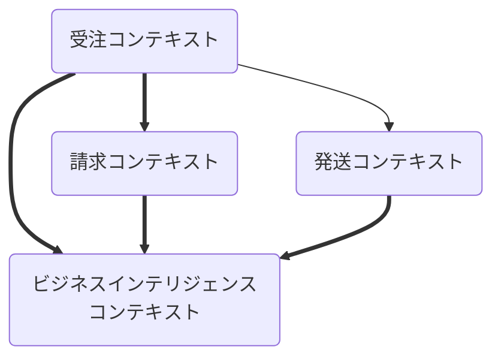

## この章でやりたいこと

永続化には、各コンテキストごとに、『分離』されている必要がある。
データ視点の分離を行う。

## 目標

境界づけられたコンテキストが切り離され、独立して進化できるようにすること。

システムAとシステムBが独立していても同じデータストアにアクセスしていたらそれは結合していることとおなじ

#### 『分離』を実装する方法

・物理的に分離    ・・・    コンテキスト毎にに異なるデータベースやデータストアをもっている  
・論理的に分離    ・・・    一つのデータベース内で、各コンテキストごとに名前空間にわける

## 12.3.1

複数のコンテキストから、一つのデータベースにアクセスする必要がある、がよろしくない

### 解決方法

紹介されているのは二つ

ビジネスインテリジェンスを別のドメインとして扱い

1.  **レポーティングとして最適化された別システム** にサブスクライブする形でコピー
2.  元なるシステムからBIシステムにそのままコピー

#### 方法１について
解釈として、実業務でためていたデータベースのデータを、コンテキスト用（例えば調査用）にチューニングされたDBに移し替える。

以下の図は、
様々なコンテキストが、最終的にBIコンテキストに格納されている図となる

#### それぞれの方法のメリット
方法１・・・ランニングコストが少ない（最適化された分、元システムに影響を受けない）  
方法２・・・イニシャルコストが少ない

